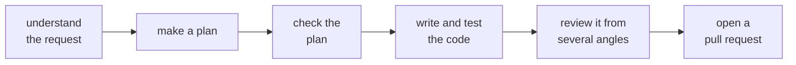

# zBuild

**zBuild helps you build software the same way every time — so a project stays consistent as it grows.**

You give zBuild a task — a sentence describing what you want, or a link to a GitHub issue — and it carries that task through a fixed series of steps: understand the request, make a plan, write the code, run the tests, review the result, and open a pull request for you to approve. AI does the work at each step; zBuild is the conductor that makes sure every task goes through the same steps in the same order.

The point is **consistency**. You decide once what your steps are — zBuild calls that a *template* (think of it as a recipe) — and from then on every change runs through that same recipe. Over time your codebase becomes more uniform, because it was all built the same way.

## Who is this for?

- **Individuals** who want a repeatable, mostly hands-off way to make changes to their own projects.
- **Teams** who want everyone's changes to follow the same process and quality checks.
- **Tinkerers** — every step is swappable, so you can shape zBuild around your own way of working.

## What problem does it solve?

Software gets messy when every change is made a little differently. zBuild removes that drift by running every change through the same reviewable recipe. It's careful by design: it only shows an AI the parts of your code a step actually needs, and if a run is interrupted it can pick up exactly where it left off. Nothing lands in your project without your review — zBuild finishes by opening a pull request.

## Try it (about 5 minutes)

You'll need a few common command-line tools first: **Bash 5 or newer**, `git`, `jq`, the GitHub CLI (`gh`), plus `rsync`, `flock`, and (on macOS) `coreutils`. The [Installation](https://github.com/ezigus/zBuild/wiki/Installation) page has the exact one-line install command for macOS and Linux — run it before `./install.sh`.

```bash
# 1. Get the code
git clone https://github.com/ezigus/zBuild ~/code/zBuild
cd ~/code/zBuild

# 2. Install it (adds a "zbuild" command to your account)
./install.sh

# 3. Do a "dry run" — this shows what zBuild WOULD do, without changing anything
zbuild pipeline start --goal "Add a test for the login screen" --dry-run
```

When you're ready for a real run, point zBuild at a GitHub issue and let it do the work:

```bash
zbuild pipeline start --issue 42
```

## How it works (in plain terms)

A **run** takes one task from start to finish. Along the way it moves through a series of **steps** — for example: *understand → plan → build → test → review → open a pull request.*

- A **template** is the recipe: which steps run, and in what order. zBuild ships with a ready-made one called `simple`. Use it as-is, change it, or write your own.
- Each step is handled by a small, replaceable piece (zBuild calls these **plugins**). Because steps are replaceable, you can add, remove, or swap one without rewriting zBuild.
- You stay in control: a run ends with a pull request, so you review before anything merges.

Here is the shape of the shipped `simple` recipe — just the default example; the steps are yours to change:



## Set it up your way

- **Which AI model it uses** is a setting you can change — it isn't baked into the code.
- **Templates** let you choose or design the steps. zBuild ships `simple` (the everyday recipe) and `deployed` (which adds deploy, validate, and monitor steps).
- **Per-project tweaks** live in a `.zbuild/` folder inside your repository, so each project can adjust the steps and wording.

The [Configuration](https://github.com/ezigus/zBuild/wiki/Configuration) page walks through each of these.

## Common commands

```
zbuild pipeline start --issue 42               # start a run from a GitHub issue
zbuild pipeline start --goal "add a login test" # ...or from a plain-language goal
zbuild pipeline resume                         # continue an interrupted run
zbuild status                                         # see what's happening
zbuild doctor                                         # check your setup
zbuild --help                                         # the full list
```

The full command reference lives in the [Wiki](https://github.com/ezigus/zBuild/wiki).

## Where it's going

zBuild is at **version 1.0** today. Planned work is organized into *initiatives* on the [Roadmap board](https://github.com/users/ezigus/projects/2) and the [milestones list](https://github.com/ezigus/zBuild/milestones). See [`CHANGELOG.md`](CHANGELOG.md) for what shipped.

## Advanced

> This section is for readers who already know zBuild and want the technical model. If you're new, you can skip it.

zBuild is a deliberately small engine plus interchangeable plugins. Templates compose *stages* over a closed set of *operators* — `leaf`, `sequence`, `parallel`, `cycle`, and a data-driven `map`. All model-bound text passes through a single redaction chokepoint (ADR-004); run state is atomic and resumable (ADR-006); model selection is data-driven via stable tiers T0–T4 (ADR-003); stages resolve by role-then-id (ADR-042/047). Deeper design docs: [VISION](docs/VISION.md), [ARCHITECTURE](docs/ARCHITECTURE.md), [KEEPERS](docs/KEEPERS.md), and the [ADRs](docs/adr/).

## Contributing & license

Design and contributor docs live in [`docs/`](docs/); how we write these docs is described in [`docs/DOC-STYLE.md`](docs/DOC-STYLE.md). Run `npm test` for the full suite before opening a PR. Licensed under MIT — see [LICENSE](LICENSE).

<!-- BEGIN:generated-docs -->
## Documentation

Full reference documentation is published to the [project wiki](../../wiki): a page for each of the 36 plugins and 16 mechanics, plus the Installation, Getting Started, Configuration, and CLI Reference guides. These pages are generated from the plugin manifests and the mechanics registry, then republished on each release.
<!-- END:generated-docs -->
