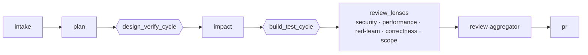

# zBuild

**A flexible, plugin-based engine for composing AI delivery pipelines** — run an issue or a goal through a template (`plan → build → test → review → PR`, or whatever subset you compose) the same way, every time.

## What it is — and why

zBuild gives any individual or team a **flexible way to create consistent structure in how they build software**. You encode your process once as a **template**, then run every repository and every change through that same template the same way each time — and the implementation grows steadily more consistent.

Flexibility exists to serve consistency. The engine is intentionally small; **all behavior is plugin-delivered and template-composed**, so you adapt zBuild to your workflow rather than bending your workflow to a tool. It is safety-first by design: every model-bound prompt passes through a single redaction chokepoint, state is atomic and crash-safe (runs resume where they stopped), and file scope is governed.

See [`docs/VISION.md`](docs/VISION.md) for the full North Star.

## How it works

A run is a **template** — a composition of stages over a small, closed set of operators (`leaf`, `sequence`, `parallel`, `cycle`, and data-driven `map`). The CLI drives a small core engine (event bus, router, state, redaction); every stage is delivered by a **plugin**.

The diagram below is **one example: the `simple` template shipped with zBuild.** Templates are fully user-composable — down to a single stage — so you can run the whole delivery pipeline, or just a design-only or review-only slice.



`design_verify_cycle` and `build_test_cycle` are bounded convergence cycles (they iterate until a gate passes, then move on). The review lenses are advisory; mechanical gates are what block a merge. The `deployed` template extends `simple` with `deploy → validate → monitor`.

## Quick start

**Prerequisites:** `bash` ≥ 5, `git`, `jq`, `gh` (GitHub CLI), `rsync`, `flock`, and `coreutils` (macOS, for `gtimeout`).

```bash
# macOS
brew install bash git jq gh rsync flock coreutils
# Linux (Debian/Ubuntu)
sudo apt install bash git jq gh rsync util-linux
```

**Install** (copies the runtime into `~/.local/share/zbuild` and installs `zbuild` + `zb` shims into `~/.local/bin`):

```bash
git clone https://github.com/ezigus/zBuild ~/code/zBuild
cd ~/code/zBuild
./install.sh
```

**First run** — a dry run against a goal (makes no changes):

```bash
zbuild pipeline start --goal "Add an e2e test for the checkout flow" --dry-run
```

Then a real run driven by a GitHub issue:

```bash
zbuild pipeline start --issue 42
```

## Configure

- **Models are data, not code.** Model selection goes through the router reading [`config/models.json`](config/models.json), organized into stable tiers **T0–T4** (by ordinal — code never names a model). Swap or reprice models without touching logic. (ADR-003)
- **Templates.** `simple` is the default; `deployed` adds delivery stages. Compose your own from the operators above.
- **Per-repo overrides.** Drop repo-local overrides in `.zbuild/` — `.zbuild/templates/` (ADR-016), `.zbuild/prompts/` (ADR-032), and `platforms.json` (ADR-009).

## CLI cheat-sheet

```
zbuild pipeline start --issue <N>|--goal "<text>" [--dry-run] [--scope <path>]... [--platform-override <p>] [--no-resume]
zbuild pipeline resume [--run-id <id>] [--force]     # resume an interrupted run
zbuild --resume-latest | --attach <run_id>           # resume newest / tail a live run
zbuild status                                        # pipeline status
zbuild doctor                                        # validate install + config
zbuild plugin list                                   # list discovered plugins
zbuild cleanup [--dry-run|--apply]                   # prune stale branches/state/stashes
zbuild upgrade --from <source-clone>                 # pull + re-install
zbuild --version | --help
```

Full reference (every subcommand, flag, exit code, and environment variable) lives in the [Wiki](https://github.com/ezigus/zBuild/wiki).

## Release model

zBuild follows SemVer with a cadence policy:

- **major** = a manual milestone release (this is **1.0.0** — phases 0, 0.5, and 1),
- **minor** = a weekly, automated cut,
- **patch** = a hotfix.

See [`CHANGELOG.md`](CHANGELOG.md) and [Releases](https://github.com/ezigus/zBuild/releases).

## Roadmap

Tracked in the release initiative ([#1362](https://github.com/ezigus/zBuild/issues/1362)): Phase 1.1 automates the release/versioning/docs pipeline and adds a required, prompt-injected repo vision standard. Beyond that (1.5+): assessor-driven convergence and engine-owned personas.

## Contributing & architecture

zBuild's design lives in [`docs/`](docs/): [VISION](docs/VISION.md) (North Star), [ARCHITECTURE](docs/ARCHITECTURE.md) (system view, plugin contract, data flow), [KEEPERS](docs/KEEPERS.md) (behaviors preserved from the upstream system, frozen in `legacy/`), and the [ADRs](docs/adr/) (formal decisions). Work is organized by phase as GitHub milestones. Run `npm test` for the full bash suite before opening a PR.

## License

MIT — see [LICENSE](LICENSE).
