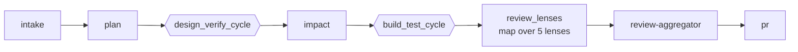

# Pipeline & Stages

When you ask zBuild to work on an issue, it runs a **pipeline** — an ordered sequence of steps that takes a GitHub issue from raw text to a merged pull request. Each step is called a **stage** (for example, "plan the work", "write the code", "run the tests"). Stages are grouped into a **template**, which is just a named list of stages you can choose when starting a run.

You don't need to understand the internals to use zBuild. Start here, and read further down only when you need to customize or debug.

## How a run looks from the outside

```bash
zbuild pipeline start --issue 42
```

zBuild works through the stages in order. You can watch progress live:

```bash
zbuild --attach <run_id>
```

When it finishes, a pull request is open and ready for review.

## The `simple` template (the default)

The `simple` template is what most runs use. Here is the flow:



What each stage does:

- **intake** — reads the issue and gathers context.
- **plan** — writes a plan for the work.
- **design_verify_cycle** — drafts a design and checks it against a **gate** (a pass/fail quality check) until the design passes or the attempt limit is reached.
- **impact** — analyses which files and systems the change will touch (advisory; does not block progress).
- **build_test_cycle** — writes the code, runs the tests, and checks the result. Loops until tests pass or the attempt limit is reached.
- **review_lenses** — five advisory lenses (security, performance, red-team, correctness, scope) each add findings.
- **review-aggregator** — merges the lens findings into a single advisory report.
- **pr** — opens the pull request.

The word **cycle** means a stage that can repeat: zBuild runs it, checks whether it passed, and runs it again if needed, up to a maximum number of attempts.

The **`deployed` template** extends `simple` by adding `deploy → validate → monitor` after the `pr` stage.

## Gates: what can block a run

A **gate** is a mechanical pass/fail check. Gates do not use AI judgement — they check objective criteria (test results, required fields, and so on). The **gate-aggregator** is the only stage that can hold up the pull request; the review lenses are advisory and never block it.

## Per-run state

Every run writes its events and artifacts to `~/.zbuild/state/runs/<run_id>/`. A `latest` symlink always points to the most recent run. Runs are resumable — if one is interrupted, you can pick it up where it left off (see [[Troubleshooting]]).

---

## Advanced — internals (newcomers can skip)

This section covers how the engine resolves stages and manages convergence. You do not need it to use zBuild.

### Template resolution

A template is a composition of stages over the closed operator set in [[Mechanics]]. Each stage is delivered by a **plugin** (see [[Plugins]]); the engine resolves stages by role-then-id (ADR-042/047), so the flow is data-driven, not hardcoded.

### Cycles and convergence

Cycles are bounded and converge via [[mechanics/convergence]] (`exit_when`, `on_max`). `build_test_cycle` can [[mechanics/route_back]] to design if a structural problem is found. The [[mechanics/gates]] reference has the full verdict semantics.

### State internals

Per-run state lives at `~/.zbuild/state/runs/<run_id>/` with an `events.jsonl` trace. See [[mechanics/state-and-resume]] for the full resume protocol and atomic-state guarantees.
