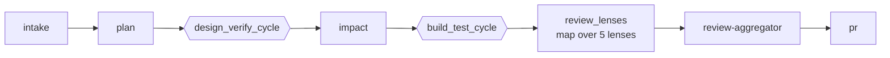

# Pipeline & Stages

A run executes a **template**: a composition of stages over the closed operator set in [[Mechanics]]. Each stage is delivered by a **plugin** (see [[Plugins]]); the engine resolves stages by role-then-id (ADR-042/047), so the flow is data, not hardcoded.

## The `simple` template (default)

Stage by stage:
- **intake** → **plan** — understand the issue/goal and produce a plan.
- **design_verify_cycle** — a [[mechanics/cycle]]: `design → design-gate`, exits when the design gate passes.
- **impact** — advisory impact analysis.
- **build_test_cycle** — a cycle: `build → test → shape-floor → acceptance-gate → secret-scan → gate-aggregator`, exits when the [[mechanics/aggregators|gate-aggregator]] passes. Can [[mechanics/route_back]] to design.
- **review_lenses** — a [[mechanics/map]] over `security, performance, red-team, correctness, scope` (advisory).
- **review-aggregator** — merges lens findings (advisory).
- **pr** — opens the pull request.

The **`deployed`** template extends `simple` with `deploy → validate → monitor`.

## Gates & convergence
Mechanical [[mechanics/gates]] decide pass/fail; the **gate-aggregator is the sole merge-blocker**. Review lenses are advisory. Cycles are bounded and converge via [[mechanics/convergence]] (`exit_when`, `on_max`).

## State
Per-run state lives at `~/.zbuild/state/runs/<run_id>/` with an `events.jsonl` trace; runs are atomic and resumable (see [[mechanics/state-and-resume]]).
